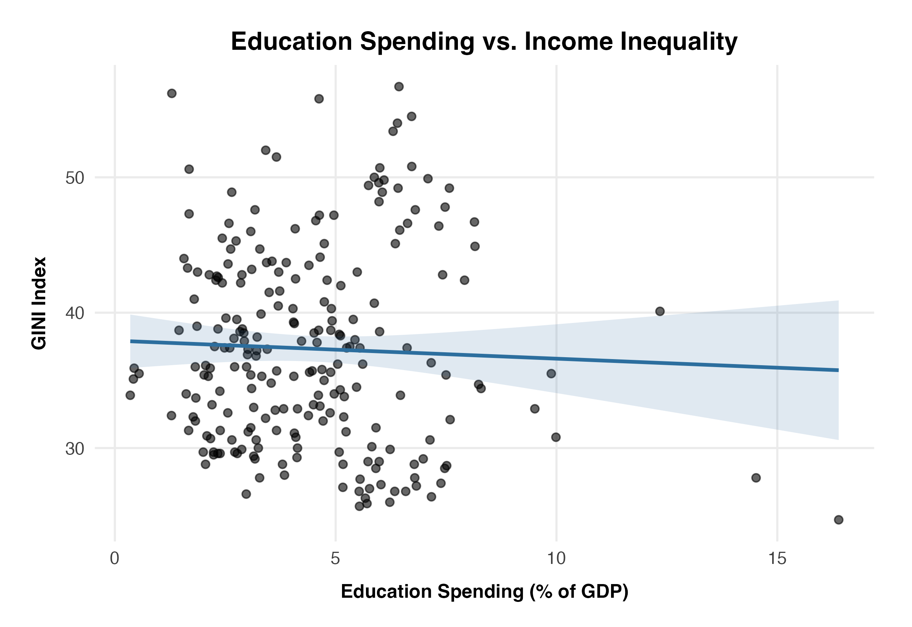
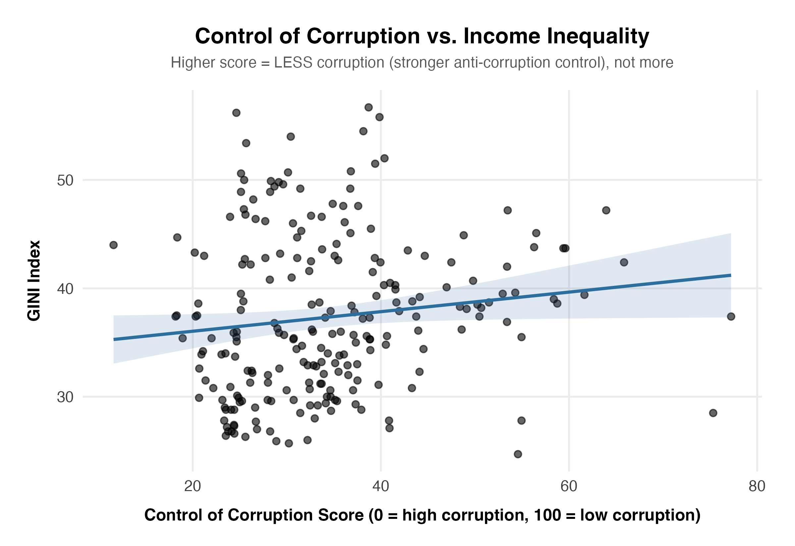
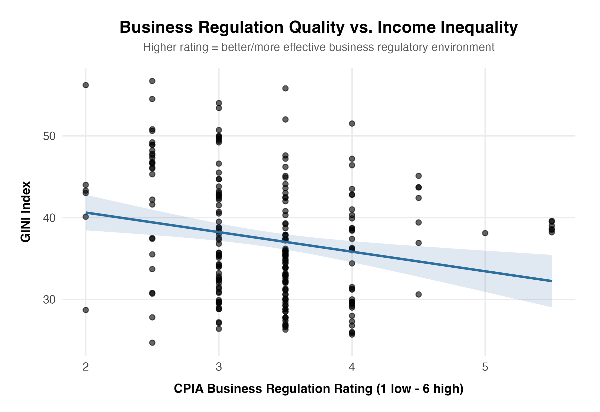
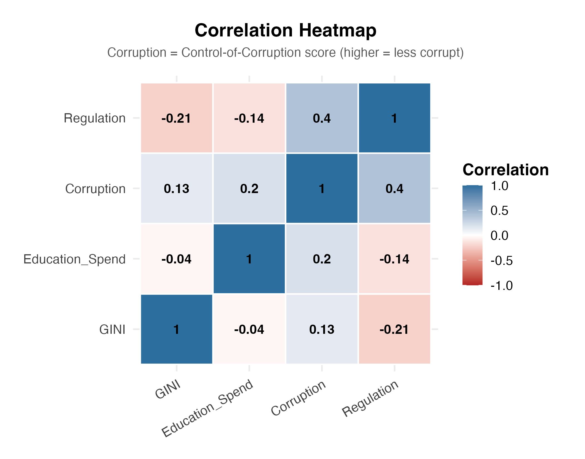

# Governance, Spending, and Inequality: An Analysis

An analysis of how income inequality (GINI index) relates to three country-level factors: government spending on education, control of corruption, and quality of business regulation. Built using World Bank data.

## Overview

This project investigates whether cross-country variation in income inequality is associated with government education spending, corruption control, and regulatory quality. Each factor is tested independently against GINI using correlation and linear regression, rather than combined into a single multivariate model — this is intentional, and explained further under Methodology.

## Research Questions

- Does government education spending (% of GDP) correlate with lower income inequality?
- Does stronger control of corruption correlate with lower income inequality?
- Does higher-quality business regulation correlate with lower income inequality?

## Data Sources

All data comes from the World Bank's open data portal (data.worldbank.org).

| Variable | Indicator | Notes |
|---|---|---|
| Income inequality | GINI Index | Survey-based; reported irregularly (not annually) for most countries |
| Education spending | Government expenditure on education, % of GDP | Chosen over per-student or total-dollar metrics to measure policy priority independent of country size |
| Corruption | Control of Corruption (Worldwide Governance Indicators) | Higher score = stronger corruption control = less corruption. This is counterintuitive on first read and is labeled explicitly on all plots. |
| Regulation | CPIA Business Regulatory Environment rating | Coverage limited to IDA-eligible/low-income countries — see Limitations |

Raw files are stored in `data/raw/`. Cleaned, merged data used for analysis is in `data/processed/`.

## Project Structure

```
econ-analysis-project/
├── data/
│   ├── raw/                  # Original World Bank downloads, untouched
│   └── processed/
│       ├── long_form.csv     # Final cleaned dataset (Country, Year, GINI, Education_Spend, Corruption, Regulation)
│       └── models/           # Saved .rds regression models, reused across notebooks
├── notebooks/
│   ├── data-cleaning.ipynb        # Reshaping, merging, and cleaning all four data sources
│   ├── statistical-analysis.ipynb # Correlation and regression tests
│   └── plot-generation.ipynb      # Final visualizations
├── .gitignore
└── README.md
```

## Setup

1. Clone the repo:
   ```
   git clone https://github.com/yourusername/governance-inequality-analysis.git
   cd governance-inequality-analysis
   ```
2. Install Python dependencies:
   ```
   python -m venv venv
   source venv/bin/activate
   pip install -r requirements.txt
   ```
3. Install R and the required packages (statistical analysis and plotting notebooks use R):
   ```r
   install.packages(c("ggplot2", "dplyr", "tidyr"))
   ```
4. Run the notebooks in order: `data-cleaning.ipynb` → `statistical-analysis.ipynb` → `plot-generation.ipynb`. Each stage reads the previous stage's saved output, so they need to run in sequence on a fresh clone.

## Methodology

Each predictor (education spending, corruption control, regulation quality) is tested against GINI as a **separate bivariate relationship** — a correlation test plus a simple linear regression per predictor, not one combined multivariate model. This keeps each result easy to interpret on its own, at the cost of not accounting for interaction between the three predictors. That tradeoff is a deliberate scope decision, not an oversight — see Limitations.

Fitted regression models are saved to `data/processed/models/` as `.rds` files after the statistical analysis notebook runs, so the plotting notebook reuses the exact fitted model rather than silently re-fitting its own copy with `geom_smooth()`. This keeps the reported statistics and the plotted regression lines guaranteed consistent with each other.

## Results

### Education Spending vs. GINI


[correlation coefficient, p-value, brief interpretation]

### Corruption Control vs. GINI


[correlation coefficient, p-value, brief interpretation — remember: higher score = less corruption]

### Business Regulation Quality vs. GINI


[correlation coefficient, p-value, brief interpretation]

### Correlation Overview


[brief interpretation of the overall pattern across all four variables]

## Limitations

- **Correlation, not causation.** Significant relationships here don't establish that any predictor *causes* changes in inequality — other unmeasured factors could drive both.
- **Sample size drops sharply once all four sources are required.** Requiring complete data across GINI, education spending, corruption, and regulation shrinks the dataset from 164 countries / 1,403 rows to 83 countries / 229 rows, primarily because CPIA regulation data only covers IDA-eligible/low-income countries. Results should be read as applying to that narrower, lower-income-skewed sample, not to all countries globally.
- **GINI reporting is sparse and irregular.** Most countries report GINI every 2–5 years via household surveys, not annually, which limits how precisely trends can be tracked over time.
- **Bivariate design.** Each predictor is tested independently against GINI. This project does not model how education spending, corruption, and regulation might interact with or confound each other — a multivariate model would be a natural next step.

## Tools

- **Python** — data acquisition and initial cleaning (`pandas`)
- **R** — statistical analysis and visualization (`ggplot2`, base R `lm()`/`cor.test()`)
- **Jupyter** — notebook environment for both

## License

This project is licensed under the MIT License — see the [LICENSE](LICENSE) file for details.
